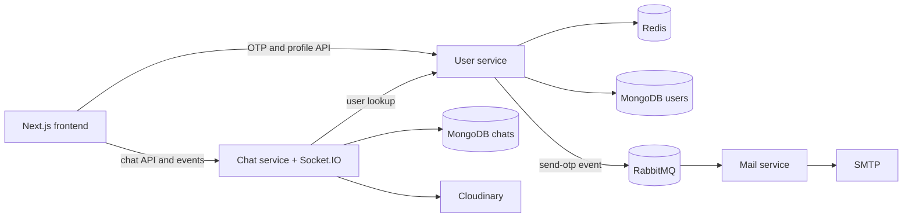

# Chatify

Chatify is a real-time messaging application built as three Node.js services and
a Next.js frontend. The project demonstrates service boundaries, asynchronous
email delivery, short-lived OTP authentication, persistent conversations, live
presence, typing indicators, read status, and image messages.

## What it demonstrates

- Passwordless email sign-in with a six-digit OTP
- Five-minute OTP expiry and one-minute request throttling in Redis
- Asynchronous OTP email delivery through RabbitMQ
- Real-time messages, presence, typing events, and read receipts with Socket.IO
- Conversation and message persistence in MongoDB
- Image upload and delivery through Cloudinary
- JWT-based access to user and chat APIs
- Independent user, mail, chat, and frontend processes

## Architecture



## Repository structure

```text
Chatify/
├── frontend/       Next.js user interface
└── backend/
    ├── user/       OTP authentication, profiles, Redis, RabbitMQ producer
    ├── mail/       RabbitMQ consumer and SMTP email delivery
    └── chat/       Conversations, messages, Socket.IO, Cloudinary
```

## Technology

| Layer | Technology |
| --- | --- |
| Frontend | Next.js 15, React 19, TypeScript, Tailwind CSS |
| Services | Node.js, Express 5, TypeScript |
| Data | MongoDB, Mongoose, Redis |
| Messaging | RabbitMQ |
| Real time | Socket.IO |
| Media | Multer, Cloudinary |
| Authentication | Email OTP, JWT |

## Local setup

### Prerequisites

- Node.js 20 LTS
- MongoDB
- Redis
- RabbitMQ
- SMTP credentials for sending OTP email
- A Cloudinary account for image messages

Clone the repository:

```bash
git clone https://github.com/iamsaurabhp/Chatify.git
cd Chatify
```

Install each application:

```bash
cd backend/user && npm install
cd ../mail && npm install
cd ../chat && npm install
cd ../../frontend && npm install
```

Copy each example environment file and replace its placeholder values:

```bash
cp backend/user/.env.example backend/user/.env
cp backend/mail/.env.example backend/mail/.env
cp backend/chat/.env.example backend/chat/.env
cp frontend/.env.example frontend/.env.local
```

Start MongoDB, Redis, and RabbitMQ. For a local Docker-based Redis and RabbitMQ
setup:

```bash
docker run -d --name chatify-redis -p 6379:6379 redis:7-alpine
docker run -d --name chatify-rabbitmq -p 5672:5672 -p 15672:15672 \
  -e RABBITMQ_DEFAULT_USER=guest \
  -e RABBITMQ_DEFAULT_PASS=guest \
  rabbitmq:3-management
```

Run the four processes in separate terminals:

```bash
cd backend/user && npm run dev
cd backend/mail && npm run dev
cd backend/chat && npm run dev
cd frontend && npm run dev
```

The default local endpoints are:

| Application | URL |
| --- | --- |
| Frontend | http://localhost:3000 |
| User service | http://localhost:5000 |
| Mail service | http://localhost:5001 |
| Chat service | http://localhost:5002 |
| RabbitMQ management | http://localhost:15672 |

## Environment variables

The checked-in `.env.example` files document every required variable. Keep real
credentials in local `.env` files and never commit them.

The user and chat services must use the same `JWT_SECRET`. The chat service also
needs `USER_SERVICE` so it can resolve participant profiles. The frontend
service URLs can be changed with `NEXT_PUBLIC_USER_SERVICE` and
`NEXT_PUBLIC_CHAT_SERVICE`.

## Build checks

```bash
cd backend/user && npm run build
cd backend/mail && npm run build
cd backend/chat && npm run build
cd frontend && npm run build
```

## Production considerations

This repository is a portfolio project rather than a turnkey hosted service.
Before production use, restrict CORS origins, use TLS for external connections,
store secrets in a managed secret store, add automated API and browser tests,
and use a shared Socket.IO adapter when running more than one chat-service
instance.

## Author

[Saurabh Patil](https://iamsaurabhp.github.io/) ·
[LinkedIn](https://linkedin.com/in/iamsaurabhp/)
